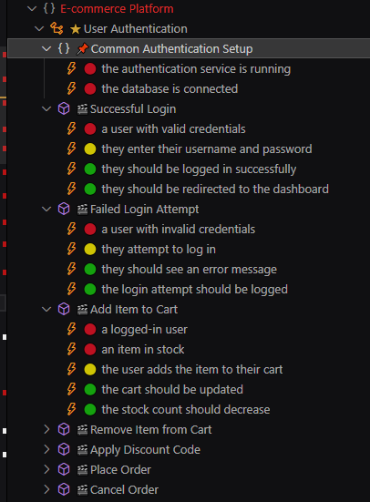

# BDD Outline for VS Code

## Overview



BDD Outline is a Visual Studio Code extension that enhances the development experience for Behavior-Driven Development (BDD) by providing a structured outline view of your BDD features and scenarios.

## Features

- **Hierarchical Outline**: Displays a structured view of your BDD elements including BDD, features, backgrounds, scenarios, and steps.
- **Collapsible Sections**: Allows collapsing and expanding of features and scenarios for better navigation.
- **Custom Icons**: Uses distinct icons for different BDD elements for easy identification.
- **Quick Navigation**: Jump to specific parts of your BDD file directly from the outline view.

## Installation

1. Open Visual Studio Code
2. Go to the Extensions view (Ctrl+Shift+X)
3. Search for "BDD Outline"
4. Click Install

Alternatively, you can download the VSIX file from the [releases page](link-to-your-releases-page) and install it manually.

## Usage

1. Open a file containing BDD-style comments (e.g., `// @feature`, `// @scenario`, etc.)
2. Open the Outline view in VS Code (usually in the Explorer sidebar)
3. You should see a structured view of your BDD elements

## Supported Tokens

The extension recognizes the following tokens in comments:

- `@bdd`: Defines the overall BDD context
- `@feature`: Marks the start of a feature
- `@background`: Defines a background for scenarios
- `@scenario`: Marks the start of a scenario
- Other step tokens (e.g., `@given`, `@when`, `@then`) are also recognized as child elements of scenarios

## Example

```javascript
// @bdd My BDD Project
// Some code...

// @feature User Authentication
// Feature-related code...

// @background Login Setup
// Background steps...

// @scenario Successful Login
// @given a user with valid credentials
// @when they enter their username and password
// @then they should be logged in successfully

// More scenarios...
```

## Contributing

Contributions are welcome! Please feel free to submit a Pull Request.

## License

[MIT License](LICENSE)

## Support

If you encounter any problems or have any suggestions, please [open an issue](link-to-your-issues-page) on our GitHub repository.

## Notes
Currently only tested for c++!